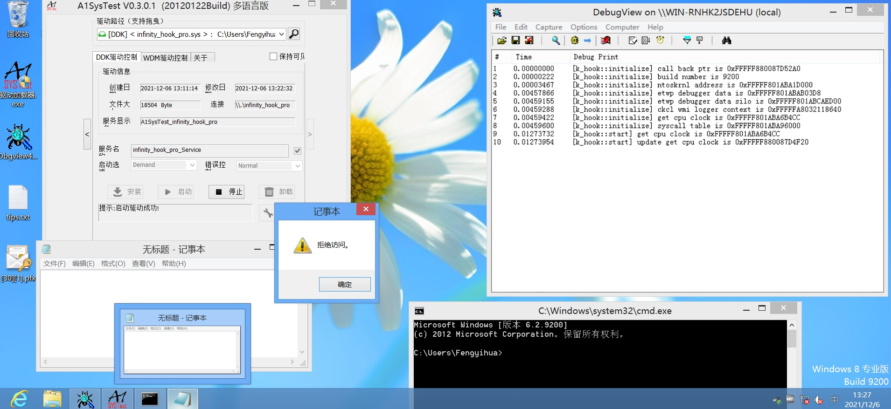
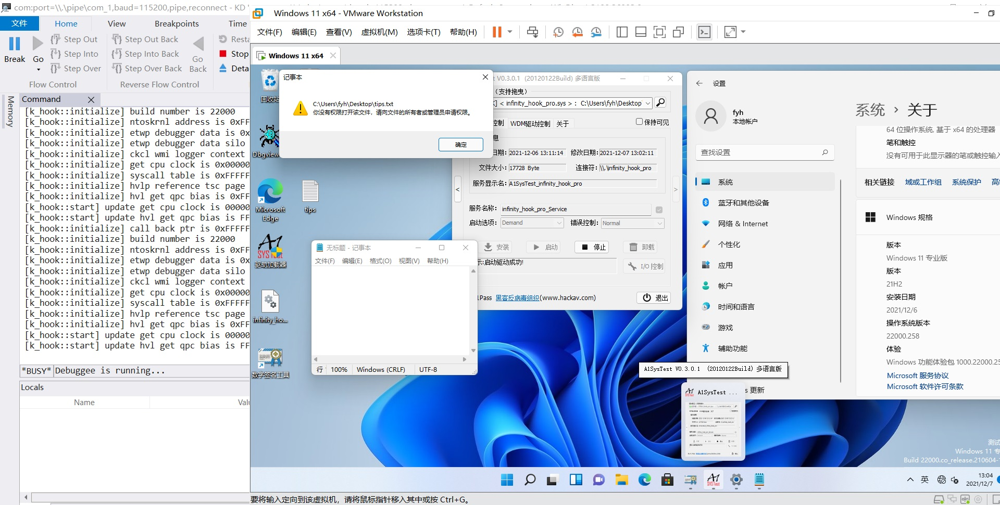

# InfinityHookPro
InfinityHookPro Win7 -> Win11 latest

最近来了兴致,拿起了InfinityHook,原始的版本有点小问题,后来改了支持Win7到Win10 1909的,后来就没有然后了

今天参考了网上大佬发出来的各种版本,最终出了这份代码,理论上支持Win7到最新版本的Win11了

Win11支持完毕,也只是GetCpuClock偏移变动而已

代码里面有很详细的注释,不懂的地方可以结合博客

再次接力,Make InfinityHook Great Again Again 💪💪💪

	参考博客
	https://bbs.pediy.com/thread-266207.htm (带逆向分析)
	https://bbs.pediy.com/thread-266136.htm	(挂钩失效问题)
	https://bbs.pediy.com/thread-260962.htm	(19041)
	https://bbs.pediy.com/thread-253450.htm	(雪碧)
	https://www.anquanke.com/post/id/206288#h2-1	(19041)
	https://www.freebuf.com/articles/system/278857.html	(2004)

	参考源码
	https://github.com/everdox/InfinityHook	(原版)
	https://github.com/fIappy/infhook19041	(19041)
	https://github.com/huoji120/MakeInfinityHookGreatAgain	(2004)

测试系统 Win7, Win8, Win10 1909, Win10 21h1, Win11 22000

<h1 align="center">
	
	
	
	
	
</h1>

